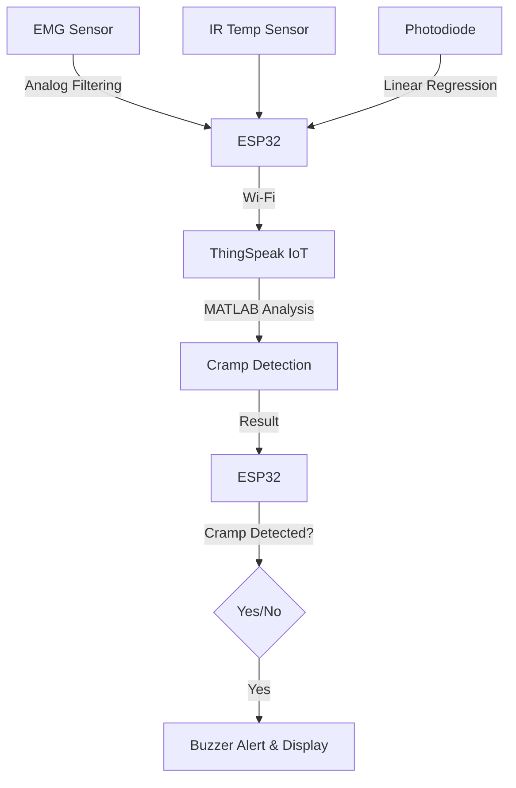

---

## **Muscle Cramp Detection System**
  
*A smart health monitoring system for early cramp detection using EMG, temperature, and oxygen saturation analysis.*

### **Overview**
This project implements a **non-invasive muscle cramp detection system** by integrating **biomedical sensors**, **IoT**, and **machine learning techniques**. The system continuously monitors **EMG signals**, **skin temperature**, and **tissue oxygen saturation (StO₂)**, processes the data using **MATLAB on ThingSpeak**, and provides real-time alerts.

---

## **System Architecture**
### **1️⃣ Signal Acquisition**
- **EMG Sensor:** Captures muscle activity.
- **IR Temperature Sensor:** Measures skin temperature.
- **Photodiode + Linear Regression:** Estimates StO₂ by calculating IR intensity ratio (hardcoded values).

### **2️⃣ Signal Processing**
- The EMG signal undergoes **noise filtering** using an **analog front-end circuit**.
- The StO₂ value is derived using a **hardcoded linear regression model**.

### **3️⃣ Data Transmission & Analysis**
- The **ESP32** microcontroller sends real-time **EMG, temperature, and StO₂** data to **ThingSpeak IoT platform**.
- **MATLAB scripts** on ThingSpeak process the signals and determine **cramp probability**.

### **4️⃣ Cramp Detection & Alert System**
- If a **cramp is detected**, the **ESP32 triggers a buzzer** and displays the **cramp ratio** on an **LCD screen**.

---

## **Workflow Diagram**

---

## **Hardware Components**
✔️ EMG Sensor  
✔️ IR Temperature Sensor  
✔️ Photodiode  
✔️ ESP32  
✔️ LCD Display  
✔️ Buzzer  

---

## **Technologies Used**
🔹 **Embedded C** (ESP32 Firmware)  
🔹 **MATLAB** (Signal Processing on ThingSpeak)  
🔹 **ThingSpeak IoT Platform** (Cloud Analysis)  
🔹 **LTSpice** (Circuit Simulation)  
🔹 **Linear Regression** (StO₂ Estimation)

---

## **Final Product Image**

---

## **How to Use**
1. **Power on** the ESP32-based device.
2. **Wear the EMG and temperature sensors** on the target muscle area.
3. **Data is transmitted** to ThingSpeak in real-time.
4. **MATLAB analysis** determines the likelihood of a cramp.
5. **If cramp detected:**  
   - The **buzzer sounds an alert**.  
   - The **cramp ratio is displayed** on the LCD.  

---

## **Future Enhancements**
✅ **Improve StO₂ accuracy** using optimized machine learning models.  
✅ **Develop a mobile app** for real-time cramp monitoring.  
✅ **Integrate Bluetooth support** for offline data analysis.  

---

## **Contributors**
- **[Thamilezai Ananthakumar](https://github.com/ThamilezaiAnanthakumar)** 
- **[Dayananthan](https://github.com/Dayananthan2021)**
- **[Prathishanth](https://github.com/pirathi2002)** 

---

## **References**
🔗 [ThingSpeak IoT Platform](https://thingspeak.com/)  
🔗 [ESP32 Documentation](https://www.espressif.com/en/products/socs/esp32/resources)   

---

### 🚀 **This project bridges IoT, Signal Processing, and biomedical engineering for real-time muscle health monitoring.**  

